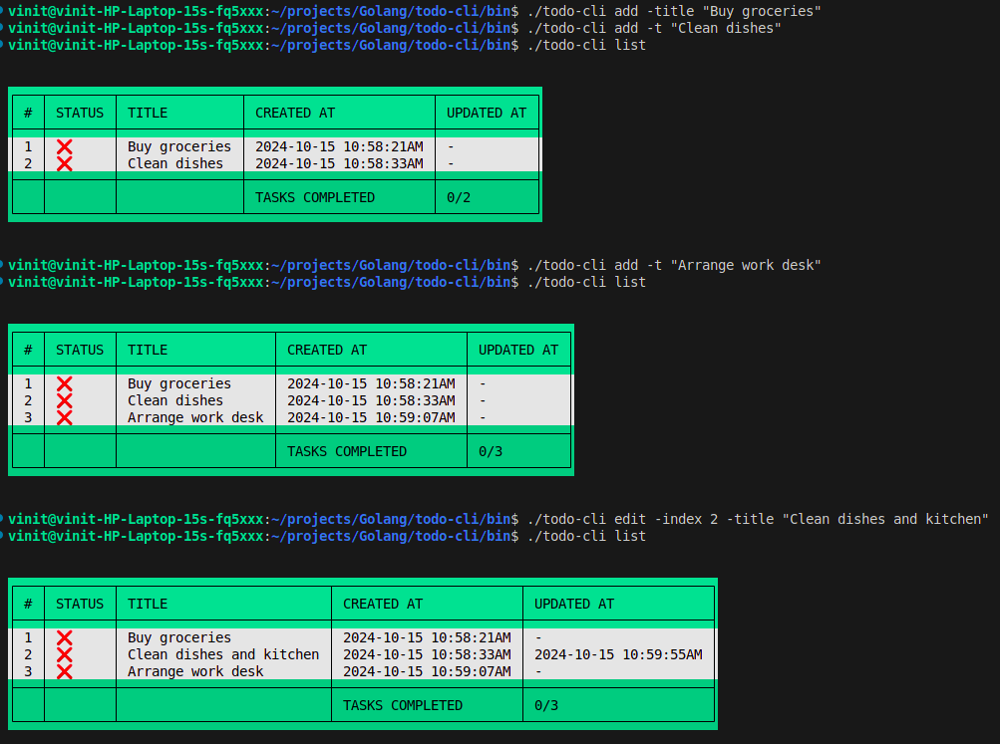
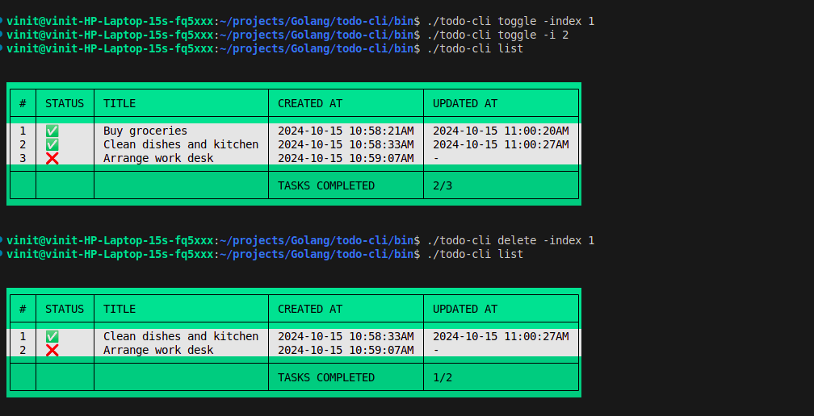

# TODO CLI APP

Simple Todo management app using json file for persistent storage




---

### Supported Commands and Subcommands
1. add : Add a new todo.
    - -title or -t : Title of todo
2. edit : Edit an existing todo
    - -index or -i : Index of todo
    - -title or -t : New title of todo
3. toggle : Toggle the completion status of a todo
    - -index or -i : Index of todo
4. delete : Delete an existing todo
    - -index or -i : Index of todo
5. list : List all the todos as table

---
## Usage:

Build from source code:

```
go build -o todo-cli .

./todo-cli <command> -<flag1> val1 -<flag2> val2
```

OR

Install it as binary

```
go install github.com/Vinitkumar041196/todo-cli@latest

todo-cli <command> -<flag1> val1 -<flag2> val2
```


1. To add a new todo.

```
todo-cli add -title "Todo 1"
```

2. To edit a todo.

```
todo-cli edit -index 1 -title "Todo 1 updated"
```

3. To toggle completion status of todo.

```
todo-cli toggle -index 1
```

4. To delete a todo.

```
todo-cli delete -index 1
```

5. To list all todos.

```
todo-cli list
```

